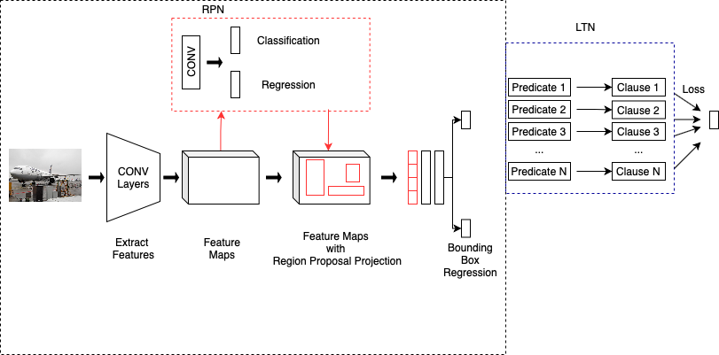

Cloned from https://github.com/yhenon/keras-frcnn

# End-to-end training of Logic Tensor Networks for object detection.

- This repository contain the code of the Master Thesis of Filomeno Davide Miro.
- It depicts my theoretical and implementative contribution to the paper [Faster-LTN: a neuro-symbolic, end-to-end object detection architecture](https://arxiv.org/abs/2107.01877)

Neural-symbolic computing aims at integrating two fundamental paradigms in artificial intelligence: machine learning (that is, the ability to learn from examples) and symbolic knowledge representation and reasoning (that is, the ability to reason from what has been learned). The objective of this thesis is the development of a novel neural-symbolic architecture for object detection in natural images. Specifically, this architecture is based on a neuro-symbolic model called Logic Tensor Networks (LTNs). The base concept behind LTNs is the grounding of a first order logic (FOL) that allows to represent symbolic knowledge as operations between tensors in a neural network; LTNs can be trained through stochastic gradient descent to maximize the satisfiability of the FOL. Not only are LTNs able to understand logical relationships between two or more objects inside the image, they also allow to encode prior knowledge that can improve the performance in the presence of scarce or noisy datasets. LTNs have been applied before to computer vision tasks. Usually, the image is processed by a pre-trained Convolutional Neural Network (CNN) or object detector to extract semantic high-level features, which are then passed to the LTN for further refinement. To the best of our knowledge, none of the existing works addresses the issues of how to jointly train the LTN and the CNN. This thesis seeks to address this gap by designing and implementing a neuro-symbolic object detector which combines a two-stage object detector (Faster R-CNN) with the LTN. This involved a radical change in the classification process. The multi-class classifier head is substituted by a set of binary predicates, grounded in an LTN module, each predicting the presence of a specific class. This results in a high data imbalance as each training batch contains at most a few positive examples. To overcome this drawback a new function is introduced for the aggregation of logical terms, denoted Focal Log Sum, which is inspired by the Focal loss.  Extensive experiments were conducted to establish the impact of different aggregation functions, training strategies, and losses. Finally, experiments are conducted to highlight how to integrate Faster-LTN with prior knowledge, in the form of logical predicates, and the impact on object recognition accuracy.

USAGE:
- train_frcnn.py can be used to train a model.
- test_frcnn.py can be used to perform inference, given pretrained weights. 

